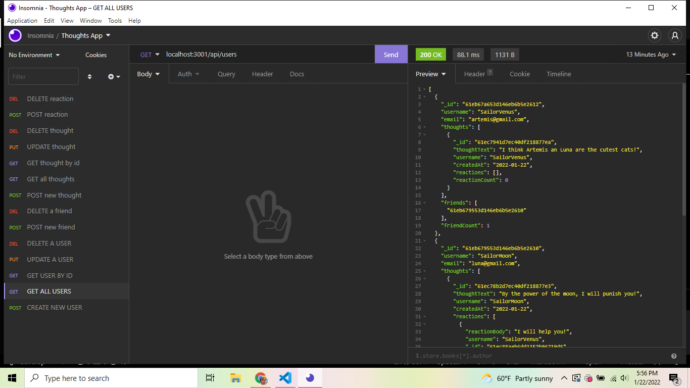

# Thoughts App 💭

## Description

- Thoughts App is the back-end web server for a social media app designed around User's sharing their Thoughts and Reacting to those thoughts. Users can add each other as friends, post/update/delete Thoughts as well as post/delete Reactions to each other's Thoughts.
- Thoughts App was created with Express and MONGODB using Mongoose.

## Table of Contents

* [Usage](#usage)
* [Credits](#credits)
* [License](#license)

## Usage

To use, download the code files and open in your terminal. In the command line, use "npm start" to start the server. Test out the GET, POST, PUT and DELETE routes in a program like Insomnia.

### Screenshot

### Links

* [GitHub](https://github.com/HaileyThomas/thoughts-app) - link to GitHub repository

## Credits

Used MONGODB, Mongoose, Express and time-stamp packages

## License

[License](https://opensource.org/licenses/MIT) - link to license

MIT License

Copyright (c) [2022] [Hailey Thomas]

Permission is hereby granted, free of charge, to any person obtaining a copy
of this software and associated documentation files (the "Software"), to deal
in the Software without restriction, including without limitation the rights
to use, copy, modify, merge, publish, distribute, sublicense, and/or sell
copies of the Software, and to permit persons to whom the Software is
furnished to do so, subject to the following conditions:

The above copyright notice and this permission notice shall be included in all
copies or substantial portions of the Software.

THE SOFTWARE IS PROVIDED "AS IS", WITHOUT WARRANTY OF ANY KIND, EXPRESS OR
IMPLIED, INCLUDING BUT NOT LIMITED TO THE WARRANTIES OF MERCHANTABILITY,
FITNESS FOR A PARTICULAR PURPOSE AND NONINFRINGEMENT. IN NO EVENT SHALL THE
AUTHORS OR COPYRIGHT HOLDERS BE LIABLE FOR ANY CLAIM, DAMAGES OR OTHER
LIABILITY, WHETHER IN AN ACTION OF CONTRACT, TORT OR OTHERWISE, ARISING FROM,
OUT OF OR IN CONNECTION WITH THE SOFTWARE OR THE USE OR OTHER DEALINGS IN THE
SOFTWARE.

## Contribution

Feel free to contribute, if you have any questions you can find my email below.

## Tests

No testing instructions at this time.

## Questions

Please contact me if you have any questions

### Contact

* [Email](mailto:haileyraebeauty@gmail.com) - Email Hailey Thomas : haileyraebeauty@gmail.com
* [GitHub](https://github.com/HaileyThomas) - GitHub username : HaileyThomas